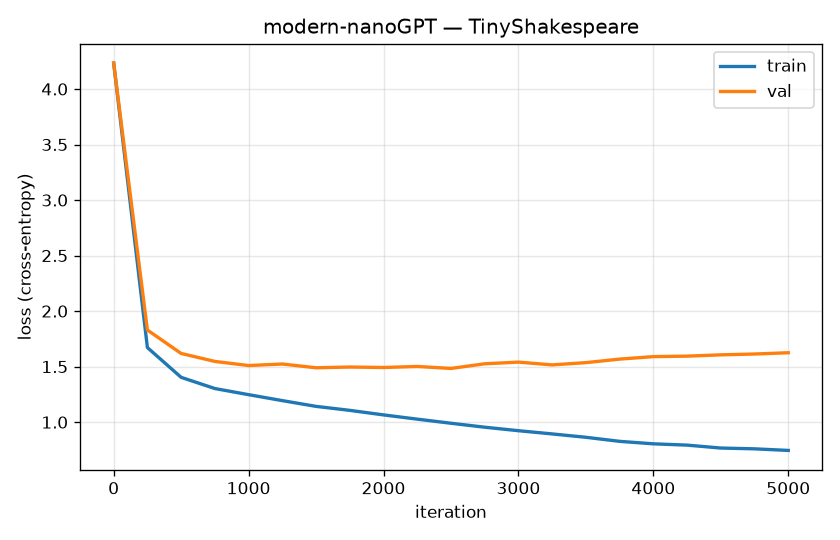

<div align="center">

# modern-nanoGPT

**A from-scratch PyTorch GPT that takes the nanoGPT / GPT-2 skeleton and adds the components common to current open-weight LLMs: RMSNorm, RoPE, SwiGLU, GQA, and no-bias + tied embeddings.**

[](https://www.python.org/)
[](https://pytorch.org/)
[](LICENSE)

</div>

---

## Overview

The skeleton of a transformer LM hasn't changed much from GPT-2: token embeddings → stacked blocks → next-token prediction. What changed between GPT-2 (2019) and a current open model (Llama / Mistral / Qwen) is a handful of internal components. This repo isolates **five of them** and implements each from scratch, so the difference between "rebuild GPT-2" and "build a current dense transformer" is explicit and testable.

No `nn.Transformer`, no HuggingFace — attention, RoPE, RMSNorm and SwiGLU are written out, each with comments that explain the rationale, so the code can be read as well as run.

A sparse follow-up (MoE + MLA, with measurement tooling) lives in **[nano-moe-mla](https://github.com/LeonelSalvo/nano-moe-mla)**.

## GPT-2 → modern: the 5 swaps

| GPT-2 (2019) | Modern (this repo) | What it does, in one line |
|---|---|---|
| LayerNorm | **RMSNorm** | normalize by vector size only — no centering, no bias; simpler and stable |
| Learned positional embeddings | **RoPE** (rotary) | rotate Q/K by position inside attention → relative positions, longer context |
| GELU feed-forward | **SwiGLU** | gated feed-forward (gate · signal, SiLU activation) — more expressive per parameter |
| Multi-Head Attention | **GQA** (grouped-query) | query heads share K/V heads → much smaller KV-cache at inference |
| Biases + separate embeddings | **no biases + tied embeddings** | fewer parameters, more stable |

All five live in [`model.py`](model.py): `RMSNorm`, `build_rope_cache`/`apply_rope`, `SwiGLU`, `Attention` (GQA), and weight tying in `ModernGPT`.

## Repo map

```
modern-nanoGPT/
├── model.py          # the model: RMSNorm, RoPE, GQA attention, SwiGLU, Block, ModernGPT
├── data.py           # char-level dataset: text → tokens, train/val batches
├── train.py          # training loop (AdamW, warmup→cosine, grad-clip); logs the loss curve, saves samples
├── sample.py         # generate text from a trained checkpoint
├── plot_loss.py      # draw loss_curve.png from the training log
├── requirements.txt
├── LICENSE
└── steps/            # the model rebuilt ONE component at a time — each a self-checking script
    ├── 00_setup.py        # verify the environment + device
    ├── 01_rmsnorm.py      # normalization (vs LayerNorm)
    ├── 02_rope.py         # rotary positions
    ├── 03_attention.py    # causal attention + GQA
    ├── 04_swiglu.py       # gated feed-forward
    ├── 05_block_model.py  # assemble the block + full model
    └── 06_train_tiny.py   # a quick training run that actually learns
```

## Build it from scratch, step by step

The [`steps/`](steps/) folder builds the model **one component at a time**, each as a small script with a self-checking test. Every step follows the same shape — *zoom out* (where the piece sits in the architecture) → *zoom in* (what it is, in plain language) → *implementation* → *test*. Run each one, watch it print `OK`, move on:

```bash
python steps/00_setup.py     # torch installed? which device?
python steps/01_rmsnorm.py   # → 02_rope → 03_attention → 04_swiglu → 05_block_model → 06_train_tiny
```

When all the pieces pass, they compose into [`model.py`](model.py).

## Run

```bash
python3 -m venv .venv && source .venv/bin/activate   # inside the venv, `python` works too
pip install -r requirements.txt

# (optional) real data — TinyShakespeare:
mkdir -p data && curl -o data/input.txt https://raw.githubusercontent.com/karpathy/char-rnn/master/data/tinyshakespeare/input.txt

python train.py            # trains; logs data/train_log.csv, saves ckpt.pt + samples.txt
python plot_loss.py        # draws loss_curve.png from the log
python sample.py "ROMEO:"  # generate from the trained model
```

Runs on CUDA, Apple MPS, or CPU. Defaults are sized for a single GPU; scale `n_layer / n_embd / block_size` up or down.

## Results

Trained on TinyShakespeare (char-level, vocab 65) on a single RTX 3090.

| | |
|---|---|
| Parameters | 9.3M |
| `n_layer` / `n_head` / `n_kv_head` / `n_embd` | 6 / 8 / 2 / 384 |
| Context (`block_size`) | 256 |
| Iterations | 5000 |
| Optimizer | AdamW, warmup → cosine decay, grad-clip 1.0, dropout 0.2 |
| Best val loss | **1.48** (early-stopped — best checkpoint was at iter 2500) |
| Training time | ~6 min on one RTX 3090 |



Train keeps dropping while val bottoms out around 1.48 and then slowly rises — textbook overfitting on a small char-level corpus — so `train.py` keeps the best-val checkpoint (early stopping).

Sample (`temperature=0.8, top_k=40`):

```
And they had worn their every trees.
There's no excuse these hate to be spoken,
My hand and will their wrathsome to her son.
The vialous Romeo is friends, no more;
But substance there the life and the king.

QUEEN MARGARET:
There is the day were lecture in thy dreams.
Be while thou hear'st and despairing flowers.

KING RICHARD III:
What care is dead?

QUEEN ELIZABETH:
Be gone, my lord.

KING RICHARD III:
Cousin, the king, and have revenged on me
```

It's not real English, but at 1.48 val loss the model has clearly learned the *shape* of a play: character names, dialogue layout, line breaks, blank verse rhythm, and near-words. That's the expected level for a ~9M char-level model on this dataset.

## Roadmap

- A **Mamba / SSM** block on the same data, for a transformer-vs-state-space head-to-head.
- BPE tokenizer instead of char-level.
- A small SFT step to turn the base model into a chat-style one.
- KV-cache at inference (GQA already makes it cheap).

## Credits

Architecture foundations from Andrej Karpathy's [*Neural Networks: Zero to Hero*](https://github.com/karpathy/nanoGPT) (nanoGPT). The modern components come from the Llama / Mistral / Qwen line of open models.

The reasoning behind each component is written out in the docstrings of [`model.py`](model.py) and the [`steps/`](steps/) files.

## License

MIT — see [LICENSE](LICENSE). Built by [Leonel Salvo](https://github.com/LeonelSalvo).
